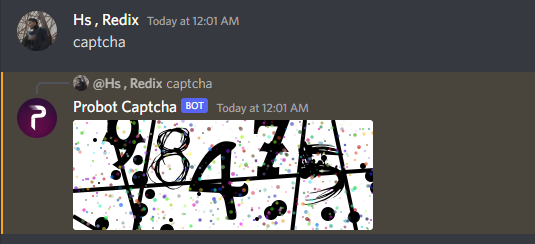

## What is probot-captcha ?
Package that can generate Probot captcha .

## Installation
```
npm install probot-captcha
```

## Usage
Discord.js v13 Example :
```js
let generateCaptcha = require('probot-captcha');

client.on('messageCreate', async message => {
    if (!message.guild) return;
    if (message.author.bot) return;
    if (message.content.toLowerCase().startsWith('captcha')) {
    let cap = await generateCaptcha()
    message.reply({files: [cap]})
    }
})
```

## Links
[Support Server](https://discord.gg/holy-s)
